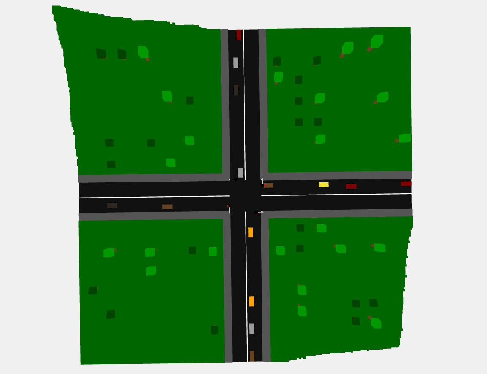
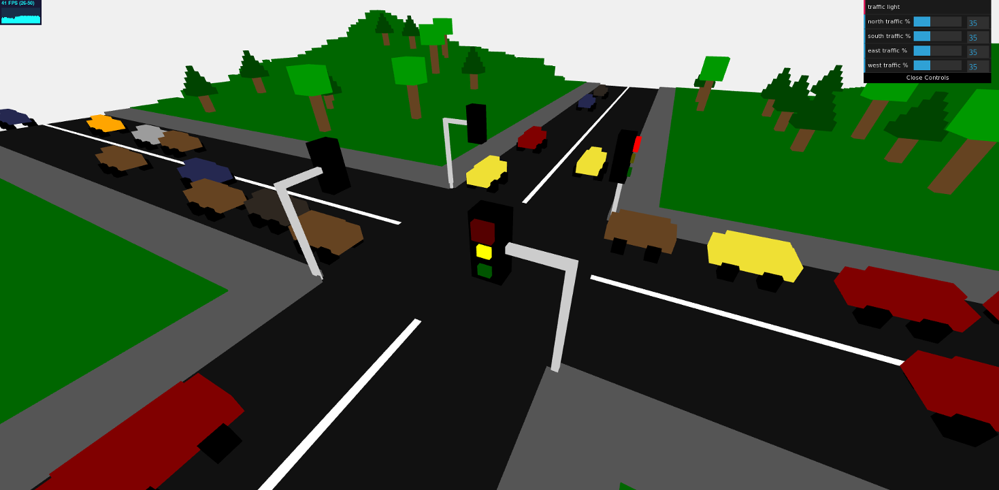
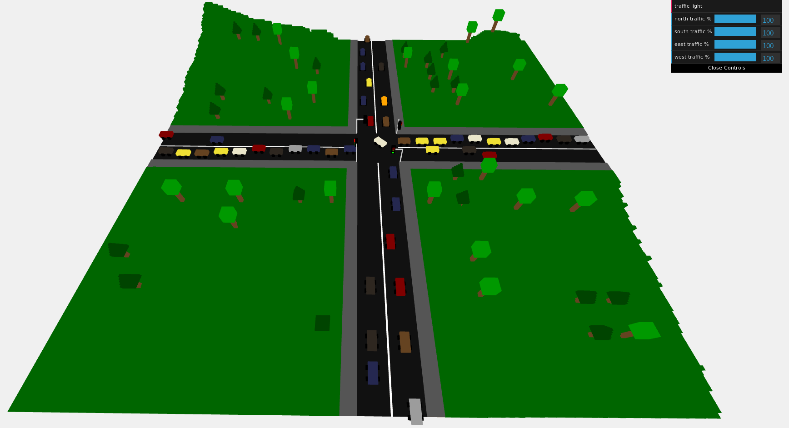

# First project for the course of Interactive 3d Graphics

## CrossySimulation

CrossySimulation is a 3D simulation of a crossroad regulated by traffic lights which can be used as a fun way to explain the traffic code to children or as a way of killing time. In the scene the cars enter the scene at the start of the road and when they arrive to the traffic light they can turn left, right or proceeds straight respecting the traffic light and the traffic code. Crossed the crossroad the cars continue to go on the chosen street before leaving the scene at the end of the road. It's possible to regulate the traffic level on every lane and change the traffic light color using the controls in the GUI.

## Membri del grupo

- Comuzzo Massimo, Matricola 131100
- Rovere Andrea, Matricola 128074

## Scena

La scena è ambientata in una zona rurale in cui è presente un incrocio tra quattro strade a due corsie, un numero di abeti e alberi posizionati in maniera casuale e alcune alture. Tale incrocio è regolato da quattro semafori. Ogni 3 secondi una macchina può entrare nella scena da una o piu delle quattro strade.

Le macchine procedono lungo la strada fino all'incrocio, una volta arrivate in prossimita dell'incrocio le macchine decidono se girare a destra, a sinistra o continuare dritto rispettando il codice della strada: controllando il colore del semaforo e dando la precedenza alle altre macchine se necessario. Se le macchine non possono attraversare l'incrocio si incolonnano mantendendo la distanza di sicurezza l'una dall'altra. Una volta attraversato l'incrocio le auto proseguono sulla strada scelta alla fine della quale escono dalla scena. 

Utilizzando i pulsanti e gli slider dell'interfaccia è inoltre possibile cambiare il colore dei semafori e impostare il livello di traffico su ognuna delle quattro strade.

### Suddivisione del codice 

- index.html è il file principale ottenuto a partire da StartingCode-nolights.html che contiene il codice html, l'inizializzazione della scena e il rendering loop 
- Tree.js contiene il codice per la generazione degli alberi
- Spruce.js contiene il codice per la generazione degli abeti
- Traffic_light.js contiene il codice per la generazione dei semafori
- Car.js contiene il codice per la generazione delle automobili
- Crossroad.js contiene il codice per la generazione delle strade e dei marciapiedi
- Car_Queue.js contiene il codice relativo alla gestione delle code di automobili e alle animazioni delle macchine

## Camera

La camera osserva la scena da una posizione di default ma l'utente può cambiare l'inquadratura muovendola e ruotandola e facendo zoom utilizzando rispettivamente i tasti destro e sinistro e la rotella del mouse ( *OrbitControl.js* ).

### Screenshot

